# 01 · From context to harness — the third era

> **TL;DR.** Applied LLM work has moved through three eras. First the bottleneck was *phrasing* (prompt engineering); then it was *information* (context engineering); by 2026 it is *autonomy and control* — the machine you build around the model so it can run on its own. That machine is the **harness**, and its founding equation is `Agent = Model + Harness`. This post explains what a harness is, why context engineering is a component *inside* it, how the field's vocabulary fits together, and why a growing body of evidence says the harness is a bigger lever than the model.
>
> **After reading this you will be able to:**
> - State, in one sentence, what a harness is and how it differs from a prompt and a context.
> - Place any agent problem in the right layer: model, scaffold, harness, or orchestration.
> - Explain why the same model can succeed or fail on the same task depending on its harness.


*Three eras, three bottlenecks. The surface the engineer works on grows from a message, to a window, to the entire machine around the model.*

---

## 1. The name changed again

In 2022 the work was **prompt engineering**: you typed one message and reworded it until the answer improved. By 2024 that name no longer fit, because most of what the model read was not the user's sentence but tools, memory, retrieved chunks, and history that an engineer had assembled. The field renamed the work **context engineering** — the discipline of assembling that whole window well. The companion *Context Engineering* series is a complete treatment of that era.

By 2026 the name has moved again, for the same reason it moved the first time: the surface got bigger. Models stopped being things you call once and started being things that *run* — taking dozens of turns, calling tools, editing files, and working for minutes or hours without a human in the loop. The moment a model runs in a loop, a new and larger surface appears around it: the code that decides what tool to execute, what to do when the tool errors, when to check the work, when to stop, and what the model is never allowed to do. That surface has a name. Everything around the model that is not the model is the **harness**, and engineering it is **harness engineering** (Osmani, 2026; OpenAI, 2026).

The clearest one-line statement of the shift comes from Anthropic's framing of its agent tooling: *if you are not the model, you are the harness.* The Claude Agent SDK is described in exactly those terms — as "the agent harness that powers Claude Code" (Anthropic, 2025–26).

---

## 2. If you're not the model, you're the harness

The founding equation of the discipline is deliberately blunt (Osmani, 2026):

```
Agent = Model + Harness
```

The **model** supplies reasoning. The **harness** supplies everything that turns reasoning into reliable action: the loop that drives the model, the tools it acts through, the filesystem it keeps state on, the verification that checks its work, the hooks that enforce rules deterministically, the sandbox that bounds the damage it can do, and the observability that lets you see and repair all of it. Post 02 names these components one by one.

The reason the equation matters is a claim that would have sounded strange in the prompt era and is now widely repeated: **a decent model with a great harness beats a great model with a bad harness** (Osmani, 2026). The model is one term in the sum, not the whole of it — and often not the term with the most headroom left. Section 5 gives the evidence.

This is not an argument that models don't matter. It is an argument about *where the marginal engineering effort now pays off*. In 2023, the highest-leverage change you could make to an LLM feature was usually a better prompt. In 2026, for anything agentic, the highest-leverage change is usually a better harness.

---

## 3. Context engineering is a component inside the harness

If you have read the *Context Engineering* series, the natural question is: *is this just context engineering with a new name?* No — and the relationship is precise.

**Context engineering designs what the model sees on a single call.** Harness engineering designs the *machine that decides what calls to make, in what order, with what tools, and when to stop.* Context engineering is one of the harness's jobs — a large and important one — but it sits alongside the loop, the tools, the verification, and the guardrails. Formally: context engineering is a component *inside* harness engineering (Faros AI, 2026; Hugging Face, 2026).


*The layers nest. Context engineering governs the inner rings — what the model sees. Harness engineering governs the machine that drives it. Orchestration governs how several such agents combine.*

A concrete way to feel the seam: compaction. Deciding *what* to keep when a context window fills — which facts survive a summary — is a context-engineering decision, taught in the CE series. Deciding *that the running loop should pause, summarise, offload the transcript to disk, and resume* is a harness decision, taught here in Post 09. The two meet at the same event and answer different questions.

Because the two series interlock, this one treats the CE material as background. Where a token-level detail is assumed — how attention reads a long window, what prompt caching is, how a reranker works — it is linked to the CE series rather than repeated.

---

## 4. The vocabulary, pinned down

The field's terms are used loosely in casual writing; this series uses them precisely (Hugging Face, 2026):

- **Model.** The neural network. On its own it only *responds* — text in, text out.
- **Scaffold.** The behaviour-defining layer wrapped around the model: the system prompt, the tool descriptions, how the model's output is parsed, and what it remembers from step to step. The scaffold shapes *what the model sees and how its words are interpreted.*
- **Harness.** The execution layer: it calls the model, handles the tool calls the model asks for, decides when to stop, catches errors, and enforces guardrails. The harness is *the runtime that drives the model through repeated cycles.*
- **Agent.** A model plus the scaffold and harness around it — the whole thing that can *act*, not just respond.
- **Orchestration.** A layer *above* the harness that coordinates several agents as units. The boundary is clean: a harness drives one model through its loop; an orchestrator manages many agents. Multi-agent systems (Part IV) are an orchestration concern.

Keeping these apart is not pedantry. "My agent is flaky" is not a diagnosis. "My agent declares victory before its work is verified" points at the harness's *verification* component; "my agent retrieves the wrong file" points at the scaffold's *context*; "my two agents overwrite each other's edits" points at *orchestration*. Naming the layer names the fix.

---

## 5. The evidence: the harness is a real lever

The strongest claim of the field — that the harness can matter more than the model — is not merely rhetorical; it is what practitioners report when they measure.

**The same model moves up a leaderboard on harness changes alone.** One engineering team is reported to have taken its coding agent from roughly 30th to 5th place on Terminal-Bench 2.0 — an agentic benchmark of real terminal tasks — *without changing the underlying model*, purely by improving the harness (Faros AI, 2026). If the model were the dominant term, a fixed model could not move that far.

**The same model shows large spreads across harnesses.** Secondary reporting of research comparisons describes the *same* model producing performance differences on the order of several-fold depending on harness design (MindStudio, 2026). These figures are reported by secondary sources rather than measured here, so treat the exact multiple with care; the direction, however, is consistent everywhere the comparison is run.

**Most failures are legible, not mysterious.** The "skill issue" reframe popularised by practitioners holds that the majority of agent failures are *configuration* problems, not model-weight problems — a missing convention, an un-enforced rule, a step that was never verified (via Osmani, 2026). That is an optimistic claim: it means most failures are fixable in the harness, by you, today.

**Models and harnesses co-train.** There is a flywheel behind all of this. Useful patterns discovered in harnesses get standardised into products; models are then trained against those patterns and get better at using them; the next harness exploits the improvement (Osmani, 2026). It is why a frontier model can feel noticeably more capable inside its native harness than when dropped into a generic one — the two were shaped together.

The practical takeaway is not "ignore the model." It is: *before you reach for a bigger model, check whether the gap you are seeing is a harness gap.* Very often it is.

---

## 6. What this series covers

This series is **framework-agnostic**, exactly like its companion. Examples are plain Python and the direct provider and reference agent SDKs; frameworks (LangGraph and peers) appear only when they materially change the shape of a solution, and never as the protagonist. Post 20 surveys the landscape neutrally.

The series goes deep on:

- The **agent loop** — reason→act→observe, and the stop conditions where most bugs actually live (Post 03).
- **Tools, code execution, skills, and MCP** as the agent's action surface at runtime (Posts 06–07).
- **State and context management inside a running loop** — the filesystem, git, compaction, offloading, and resets (Posts 08–09).
- **Verification and control** — test loops, planner/generator/evaluator splits, hooks as deterministic enforcement, sandboxes, and human-in-the-loop (Posts 11–15).
- **Scale** — multi-agent orchestration, parallel agents on a shared repo, long-horizon and multi-context execution, and loop engineering (Posts 16–19).
- **Production** — observability, harness evaluation, economics, and three build-from-scratch walkthroughs ending in a capstone coding agent (Posts 21–26).

It will *not* be a survey of every SDK or every agent framework. There are surveys; this is a tutorial. By the end of Part I you will have the vocabulary, the component map, and a failure-mode checklist; Parts II–V are depth on each piece.

---

## Common pitfalls

- **Assuming a bigger model will fix an agent that runs badly.** If the loop never verifies its work, a stronger model just declares victory more fluently. Check the harness first (§5).
- **Treating "harness engineering" as a rebrand of "context engineering".** Context is one component inside the harness, not a synonym for it (§3).
- **Confusing the scaffold with the harness.** Editing the system prompt (scaffold) will not fix a missing stop condition (harness). Name the layer, then fix it (§4).
- **Confusing a harness with an orchestrator.** Coordinating many agents is a different, higher problem than driving one model well. Solve the single-agent harness before you go multi-agent.
- **Quoting the "6× model gap" as a hard fact.** It is reported by secondary sources; cite it as reported, and prefer your own measurements (§5, and Post 22).
- **Building a bespoke tool for every action.** A general-purpose harness with bash and code execution usually beats a zoo of narrow tools (Post 06).

---

## Further reading

- Addy Osmani, "Agent Harness Engineering" (2026) — `Agent = Model + Harness`, the ratchet principle, the co-training flywheel.
- OpenAI, "Harness engineering: leveraging Codex in an agent-first world" (2026).
- Anthropic Engineering, "Building Effective Agents" (December 2024) — the model-plus-loop framing and workflow-vs-agent distinction.
- Anthropic, "Claude Agent SDK" / "Claude Code" documentation (2025–26) — "the agent harness that powers Claude Code."
- Faros AI, "Harness Engineering: Making AI Coding Agents Work in 2026" — the three-era framing and the Terminal-Bench leaderboard movement.
- Hugging Face, "Harness, Scaffold, and the AI Agent Terms Worth Getting Right" (2026) — the vocabulary in §4.
- MindStudio, "What Is Harness Engineering?" (2026) — the reported same-model performance spread.

Full citations are in [REFERENCES.md](../../REFERENCES.md).

---

## What to read next

- **[Post 02 — The anatomy of a harness](../02-anatomy-of-a-harness/index.md)**: the eleven components every harness is built from, and the map the rest of the series fills in.
- **[Post 03 — The agent loop](../03-the-agent-loop/index.md)**: if you would rather start with the machinery — reason→act→observe and the four ways a loop should stop.
- **Context Engineering, Post 01 — "Why context engineering"**: the prior era, if you are arriving without it.
