# 04 · Why the harness beats the model

> **TL;DR.** The founding claim of harness engineering is that the machine around the model is a bigger performance lever than the model itself — the same model can succeed or fail on the same task depending only on its harness. This post states that claim carefully, lays out the evidence (and flags which numbers are firm and which are merely reported), explains *why* it holds through the model–harness co-training flywheel, and turns it into a practical rule: before you reach for a bigger model, check whether the gap you are seeing is a harness gap.
>
> **After reading this you will be able to:**
> - State the "harness beats model" claim precisely, without overclaiming.
> - Weigh the public evidence — and tell a firm figure from a reported one.
> - Decide, in front of a real underperforming agent, whether to change the harness or the model.

*One reported result, drawn honestly: the same model, two harnesses, ~25 leaderboard places apart. A fixed model cannot move that far on a fixed benchmark unless the harness is the lever.*

---

## 1. The claim, stated carefully

Here is the claim in one sentence: **for agentic tasks, the harness explains more of the variance in real-world performance than the choice of model does.** [Post 01](../01-from-context-to-harness/index.md) gave the slogan — *a decent model with a great harness beats a great model with a bad harness* — and this post is the evidence and the reasoning behind it.

It is worth saying what the claim is *not*, because it is easy to overreach:

- It is **not** "models don't matter." A more capable model raises the ceiling for every harness. The claim is about where the *marginal* engineering effort pays off today, not about which term is larger in the abstract.
- It is **not** "any model with a good harness beats any model." A tiny model in a great harness will still lose to a frontier model in a great harness on a hard task.
- It **is** "for a *given* model on a *given* agentic task, the harness usually moves performance more than a plausible model swap would."

With that scoped, the evidence.

---

## 2. The firm evidence: same model, harness-only, large move

The cleanest public data points are **leaderboard moves where only the harness changed.** On Terminal-Bench 2.0 — an agentic benchmark of real terminal tasks — a coding-agent team reported moving from roughly **#30 to #5 by changing only the harness**, with the underlying model held fixed (Faros AI, 2026; a similar same-model, harness-only jump is reported by Osmani, 2026).

This is the strongest kind of evidence for the claim, and the reason the hero diagram charts *this* and nothing fancier. The logic is simple and hard to escape: **if the model were the dominant term, a fixed model could not move ~25 places on a fixed benchmark.** The benchmark did not change. The model did not change. Only the machine around it changed — and it moved 25 places. Whatever produced that movement is, by definition, not the model.

Note what is firm here and what is not. The *direction and rough magnitude* — same model, harness-only, tens of places — is a reported result you can point to. The *exact* ranks are a single team's single run; treat them as an illustration of the mechanism, not a universal constant.

---

## 3. The softer evidence: reported multiples, treated as reported

Beyond the leaderboard moves, you will see stronger-sounding figures: that the *same* model can vary **several-fold** across harnesses. These are worth knowing and worth discounting appropriately.

The "~6× same-model spread" figure circulates via secondary write-ups (MindStudio, 2026) summarising research comparisons. This series' rule — inherited from the Context Engineering series and stated in `CONTRIBUTING.md` — is **no invented numbers, and reported numbers are labelled reported.** So: the multiple is *reported*, not measured here; the underlying comparisons are not ones we have reproduced; and the honest use of the figure is "large, and consistently in the same direction," not "exactly six times."

The reason to mention it at all is that the *direction* is unanimous across every source that runs the comparison. No one reports that swapping harnesses barely moves a fixed model. When several independent secondary sources all report a large same-direction effect, the effect is probably real even if the precise multiple is not. And the correct response to any of these figures is the one the diagram footnotes: **measure your own harness** ([Post 22](../22-evaluating-harnesses/index.md)).

---

## 4. The "skill issue" reframe: failures are configuration, not weights

There is a complementary, more qualitative line of evidence: when practitioners *audit* their agent failures, most turn out to be fixable in the harness. The framing that stuck is the **"skill issue" reframe** (popularised by HumanLayer, via Osmani, 2026): the majority of agent failures are *configuration* problems, not model-weight problems.

[Post 05](../05-agent-failure-modes/index.md) is the catalogue that makes this concrete. Of its six failure modes, five — victory declaration, context anxiety, one-shotting, doom loops, silent drift — are fixed by a harness component, not a better model. Only when the right information is demonstrably in the window, in a sensible place, and the model *still* cannot do the task, do you have a genuine model problem (the distinction [Post 01](../01-from-context-to-harness/index.md) §4 drew, and the Context Engineering series before it).

This reframe is optimistic, which is why it is worth internalising: it means most of the gap between what your agent does and what the model can do is *yours to close*, today, without waiting for the next model.

---

## 5. Why it holds: the co-training flywheel

The evidence says the harness is a large lever. The *mechanism* that keeps it large is a feedback loop between harnesses and model training.

*Useful harness patterns become training signal for the next model — which is why a model feels sharper inside the harness it was shaped with.*

The loop runs like this (Osmani, 2026):

1. A harness discovers a useful pattern — bash-as-a-universal-tool, plan files, hooks, a particular tool-calling shape.
2. The pattern gets standardised into a product or SDK — Claude Code, the Codex harness, the agent SDKs.
3. The next generation of models is trained against traces full of that pattern.
4. Those models get *better at using* the pattern — and the next harness exploits the improvement.

Two consequences fall out of this, and both matter for practice:

- **A model feels different inside its native harness.** The same weights dropped into a generic harness are not the same experience, because the model and the harness were shaped together. This is why "just use the best model" quietly underrates the harness — the best model was co-trained with a harness you may not be running.
- **Harness patterns have a shelf life and a compounding value.** A pattern you invent today may become a native model capability in a generation, and the patterns you adopt from the model's native harness are the ones it is *best* at.

---

## 6. So how should you choose a model?

Accepting the claim does not mean ignoring model choice — it means *ordering* your moves correctly. A practical procedure when an agent underperforms:

1. **Diagnose first ([Post 05](../05-agent-failure-modes/index.md)).** Name the failure mode. If it is one of the five harness-fixable ones, a bigger model is the wrong tool.
2. **Exhaust the cheap harness fixes.** A verification loop, a stop condition, a hook — these are hours of work, not a re-architecture, and they are where the leaderboard moves came from (§2).
3. **Use the model's native harness where you can.** Given the flywheel (§5), the frontier model's own SDK is the setting it performs best in; a generic wrapper leaves capability on the table.
4. **Upgrade the model when — and only when — the gap is a genuine model problem.** The right information is in the window, in the right place, and the model still cannot reason through the task. Then a stronger model is exactly right (§4; Post 01 §4).
5. **Re-measure after every change ([Post 22](../22-evaluating-harnesses/index.md)).** Every figure in this post, yours included, is a measurement, not a law.

The order is the whole point. Reaching for step 4 first is the single most common and most expensive mistake in the field — you pay more per token to paper over a gap that a stop condition would have closed for free.

---

## Common pitfalls

- **Overclaiming the thesis.** "Harness beats model" is scoped to a *given* model on *agentic* tasks. It is not "models are irrelevant" (§1).
- **Quoting reported multiples as measured facts.** The "~6×" figure is reported by secondary sources; cite it as reported, and prefer your own evals (§3).
- **Charting numbers you don't have.** The hero diagram shows the one attributable data point (a rank move) and labels it as reported — it does not invent per-harness scores. Hold your own diagrams to the same rule.
- **Upgrading the model before diagnosing.** Five of six failure modes are harness gaps; a bigger model spends more to hide them (§4, §6).
- **Judging a model outside its native harness.** A generic wrapper understates a frontier model, because of the co-training flywheel (§5).
- **Treating any of these figures as stable.** Leaderboards and models move monthly. The *mechanism* is durable; the numbers are snapshots.

---

## Further reading

- Faros AI, "Harness Engineering: Making AI Coding Agents Work in 2026" — the Terminal-Bench 2.0 same-model, harness-only leaderboard move.
- MindStudio, "What Is Harness Engineering?" (2026) — the reported several-fold same-model performance spread (secondary source).
- Addy Osmani, "Agent Harness Engineering" (2026) — the co-training flywheel and the "skill issue" reframe.
- HumanLayer — the framing of agent failures as configuration, not weights (via Osmani, 2026).

Full citations are in [REFERENCES.md](../../REFERENCES.md).

---

## What to read next

- **[Post 05 — Agent failure modes](../05-agent-failure-modes/index.md)**: the catalogue behind the "skill issue" reframe — the five harness-fixable failures, one by one.
- **[Post 02 — The anatomy of a harness](../02-anatomy-of-a-harness/index.md)**: the eleven levers this post says matter more than the model.
- **[Post 22 — Evaluating harnesses](../22-evaluating-harnesses/index.md)**: how to measure the claim on your own system instead of trusting a reported figure.
